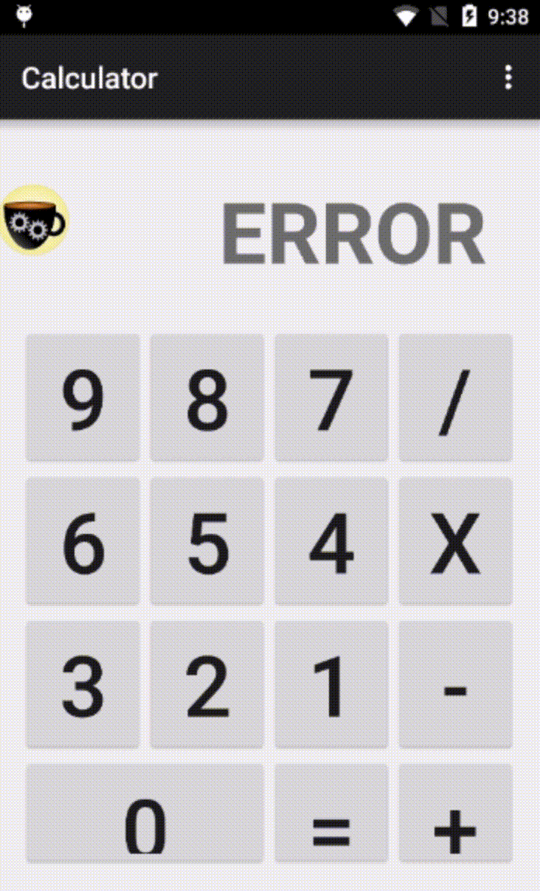

# Using Barista App

## Steps

* Install our application from the Google play store on any device running Android 4.4 or higher.

   
  [https://play.google.com/store/apps/details?id=com.moquality.barista](https://play.google.com/store/apps/details?id=com.moquality.barista)  

* Launch Barista by starting the app. Upon loading, it will load a list of locally installed apps on the device and show them to you.

  > Note:
  >
  > * If you see a blank screen, please wait for a few seconds for Barista to populate this information for you.
  > * By default, Barista only shows APK installs and not playstore or system apps. You can enable these from the **Hamburger Menu &gt; Settings**
  > * If your app is already running, Barista will just switch to it. To reset the state of your app, you can slide it in the Barista list to go to the app's settings page, where you can Force stop the appp or clear its data.

* To start an app with Barista, just tap on it inside Barista and it will be launched for you.  The first time you launch an app with Barista, follow instructions to enable the Barista Accessibility service.  Once the service is enabled, Hit back button until you return to the Barista app. 
* Once the app has been launched, you will notice the Barista icon on an overlay bubble that you can move around.  Start interacting with the app and Barista will record your interactions with the app under test, while this bubble is active and on the screen.
* At any point, you can add assertions \(checks\) by tapping on Barista icon and selecting “Add Checks”. You will see a cross-hair on the screen \(as shown in the image below\) , which can can be moved to the element to be checked. Upon leaving the bubble on the element, you will get options based on the type of UI element \(i.e., textual checks for TextViews\).

* Once you’re finished recording your test, you can tap on Barista and select “Finish & Upload Test”. You will see a preview of your tests at this point.
* When you choose to upload your test, Barista will prompt you to Sign in with your Google account. Once you sign in, Barista will send the test to the email associated with this account \(can be a non-Gmail, google account\).
* Check your inbox to find instructions to download and run the test.

